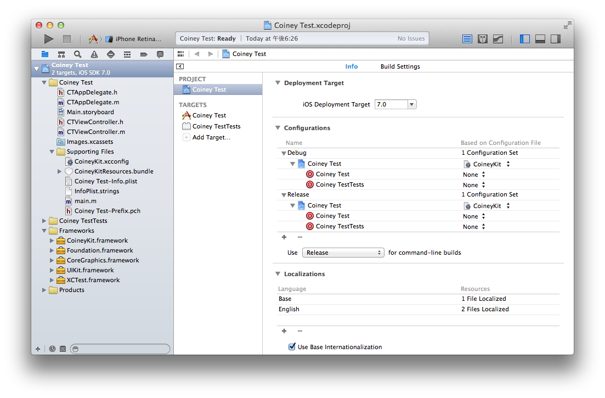

# CoineyKit

Thanks for showing interest in CoineyKit, we work hard to make it as easy to integrate as possible; but if you have any issues at all, please create a ticket using our [Issue Tracker](https://github.com/Coiney/CoineyKit-iOS/issues).

-------

# Example Application

## What we are going to create

If you follow along this tutorial, you will learn how to create a basic application, that allows the user to accept Credit Card payments using the Coiney Credit Card Reader.

## What you need

 * CoineyKit
 * Xcode 5 or above (Installed in `/Applications`)
 

## Setting up your project

Begin by launching Xcode and creating a new project: `File → New → Project`. In the dialog that appears, Choose the `Single View Application` template. And enter project options as per the screenshot below.

Now that your project is created, copy the folder `CoineyKit` to your project folder, resulting in path of `<Your project folder>/CoineyKit` .

The next step is to add `CoineyKitResources.bundle`, `CoineyKit.xcconfig` & `CoineyKit.framework` to your project. (If you use git it's a good idea to add CoineyKit as a submodule, that way you'll always know if it is up to date or not)

Now you're almost ready to make use of CoineyKit, you just need to update your build settings to use CoineyKit.xcconfig, as shown in the above screenshot.

## Making our first payment

Open up `CTViewController.h` and make it look like:

`CTViewController.h`:

    #import <UIKit/UIKit.h>
    
    @interface CTViewController : UIViewController
    @property(weak, nonatomic) IBOutlet UITextField *productNameField, *productPriceField;
    
    - (IBAction)makePayment:(id)aSender;
    @end

`CTViewController.m`:

    #import "CTViewController.h"
    @import CoineyKit;
    
    @implementation CTViewController
    
    - (IBAction)makePayment:(id)aSender
    {
        // Create a line item to pre-populate the Coiney controller with.
        NSString *name = _productNameField.text;
        int price = [_productPriceField.text intValue];
        
        CYLineItem *lineItem = [CYLineItem itemWithAmount:price
                                                 currency:CYCurrencyJPY name:name];
        
        // Create an instance of the Coiney payment controller.
        CYCoineyViewController * coineyController = [[CYCoineyViewController alloc] initWithLineItems:@[lineItem]];
        
        // Present it on top of the current controller.
        [self presentViewController:coineyController animated:YES completion:nil];
    }
    
    @end

Now hook up a button to your `makePayment:` method, and text fields to `productNameField` & `productPriceField`.

If we run the application it should appear like below:

Swipe your card to make a transaction. That's all that's required for the basic use case.

## Get notified of the transaction status

To know the status of the transaction you simply make yourself the delegate of your Coiney controller, and it will notify you when a transaction is completed or canceled.

`CTViewController.m`:

    #import "CTViewController.h"
    @import CoineyKit;
    
    @interface CTViewController () <CYCoineyViewControllerDelegate>
    @end
    
    @implementation CTViewController
    
    - (IBAction)makePayment:(id)aSender
    {
        // Create a line item to pre-populate the Coiney controller with.
        NSString *name = _productNameField.text;
        NSInteger price = [_productPriceField.text integerValue];
        
        CYLineItem *lineItem = [CYLineItem itemWithAmount:price
                                                 currency:CYCurrencyJPY 
                                                     name:name];
        
        // Create an instance of the Coiney payment controller.
        CYCoineyViewController * coineyController = [[CYCoineyViewController alloc] initWithLineItems:@[lineItem]];
        coineyController.delegate = self;
        // Present it on top of the current controller.
        [self presentViewController:coineyController animated:YES completion:nil];
    }
    
    - (void)coineyViewController:(CYCoineyViewController *)aController
          didCompleteTransaction:(id<CYTransaction>)aTransaction
    {
        NSLog(@"Completed transaction!: %@", aTransaction);
    }
    
    - (void)coineyViewControllerDidCancel:(CYCoineyViewController *)aController
    {
    	[aController dismissViewControllerAnimated:YES completion:nil];
        NSLog(@"Cancelled payment.");
    }

    
## Show the details of a transaction

You can use a transaction ID to bring up its detail view.  The view can contain a refund button if refunding should be allowed.

`CTViewController.m`:

    #import "CTViewController.h"
    @import CoineyKit;
    
    @interface CTViewController () <CYCoineyViewControllerDelegate>
    @end
    
    @implementation CTViewController
    
    - (IBAction)makePayment:(id)aSender
    {
        // Create a line item to pre-populate the Coiney controller with.
        NSString *name = _productNameField.text;
        int price = [_productPriceField.text intValue];
        
        CYLineItem *lineItem = [CYLineItem itemWithAmount:price
                                                 currency:CYCurrencyJPY name:name];
        
        // Create an instance of the Coiney payment controller.
        CYCoineyViewController * coineyController = [[CYCoineyViewController alloc] initWithLineItems:@[lineItem]];
        coineyController.delegate = self;
        // Present it on top of the current controller.
        [self presentViewController:coineyController animated:YES completion:nil];
    }
    
    - (void)coineyViewController:(CYCoineyViewController *)aController
          didCompleteTransaction:(id<CYTransaction>)aTransaction
    {
        NSLog(@"Completed transaction: %@", aTransaction);
    
        [aController dismissViewControllerAnimated:YES completion:nil];
        
        CYTransactionViewController *transactionViewController =
	        [CYTransactionViewController transactionViewControllerWithTransaction:aTransaction
	                                                               allowRefunding:YES]; // Pass NO to hide the refund button
	    // Add a navigation controller to your storyboard to make this work
        [self.navigationController pushViewController:transactionViewController animated:YES];
    }

After making a payment and tapping Done, you will see a `CYTransactionViewController` showing the details of the transaction.  (You'll need to add a navigation controller to your test app to run the above snippet.)

## Looking up a transaction

You can use a transaction's unique identifier to query the corresponding CYTransaction object, and show it in a view controller.

    CYLookUpTransaction(transactionIdentifier, ^(id<CYTransaction> transaction, NSError *err) {
        if(transaction)
            NSLog(@"Transaction found: %@", transaction);
            CYTransactionViewController *transactionViewController =
                [CYTransactionViewController transactionViewControllerWithTransaction:transaction
                                                                       allowRefunding:YES]; // Pass NO to hide the refund button
                                                                          
            transactionViewController.navigationItem.rightBarButtonItem =
                [[UIBarButtonItem alloc] initWithBarButtonSystemItem:UIBarButtonSystemItemDone   
                                                              target:self
                                                              action:@selector(dismissTransactionViewController)];
            UINavigationController *navigationController = [UINavigationController new];
            navigationController.viewControllers = @[transactionViewController];
            [navigationController setModalPresentationStyle:UIModalPresentationFormSheet];
            [self presentViewController:navigationController animated:YES completion:nil];
        }
    	else
    		NSLog(@"Transaction not found: %@", err);
    });
    
    ...
    
    - (void)dismissTransactionViewController
    {
        [self dismissViewControllerAnimated:YES completion:nil];
    }

## Printing

Receipts can be printed either by pressing the Print button in the Transaction Complete view, or by calling CoineyKit's printer API.

Printing is turned off by default.  Enable it by calling `+[CYPrinter setPrintingEnabled:]`:

`CTAppDelegate.m`:

    - (void)applicationDidFinishLaunching:(UIApplication *)aApplication
    {
        [CYPrinter setPrintingEnabled:YES];
    }

The receipt's contents and format are specified using ReceiptML, whose specification can be found [here](/Documentation/ReceiptML).

The following sample code prints a receipt automatically whenever a transaction finishes.

`CTViewController.m`
    
    #import "CTViewController.h"
    @import CoineyKit;
    
    @implementation CTViewController
    
    - (IBAction)makePayment:(id)aSender
    {
        CYCoineyViewController * const coineyController = [CYCoineyViewController new];
        [self presentViewController:coineyController animated:YES completion:nil];
    }
    
    - (void)coineyViewController:(CYCoineyViewController *)aController
          didCompleteTransaction:(id<CYTransaction>)aTransaction
    {
        NSLog(@"Completed transaction: %@", aTransaction);
    
        NSMutableString * const ml = [NSMutableString stringWithString:
                                      @"<receipt>\n"
                                      @"<title font-name=\"HiraKakuProN-W6\">Coiney Store</title>\n"
                                      @"<subtitle>123-456-7890</subtitle>\n"];
        [ml appendString:[NSString stringWithFormat:
                         @"<subtitle>%@</subtitle>\n", [NSDate date]]];
        [ml appendString:@"<ruler/>\n"
                         @"<line-item>\n"
                         @"\t<name>Item A</name>\n"];
        [ml appendString:[NSString stringWithFormat:
                         @"\t<price>%d</price>\n", [aTransaction.amount intValue]]];
        [ml appendString:@"</line-item>\n"
                         @"<total/>\n"
                         @"<ruler/>\n"];
        [ml appendString:[NSString stringWithFormat:
                         @"<subtitle font-size=\"17\">%@ %@</subtitle>\n",
                         NSStringFromCYCardbrand(aTransaction.cardBrand),
                         aTransaction.cardSuffix]];
        [ml appendString:@"</receipt>\n"];
    
        if([[CYPrinter connectedPrinters] count] == 0)
            NSLog(@"No connected printers");
        else {
            // Print
            for (CYPrinter * printer in [CYPrinter connectedPrinters]) {
                [printer batchPrint:^{
                    [printer printReceiptML:ml];
                } cutWhenDone:YES];
            }
        }
    }

Supported printer models are:

Star Micronics

* SM-S210i
* TSP650II

Epson

* TM-P60II
* TM-T20II

If you plan to include printer support, you must add the following entry to your Info.plist file, and obtain MFi certification from the printer manufacturer(s).  See the [MFi Program website](https://developer.apple.com/programs/mfi/) for further information.

	<key>UISupportedExternalAccessoryProtocols</key>
	<array>
		<string>jp.star-m.starpro</string>
		<string>com.epson.escpos</string>
	</array>

If you plan to do any printing _without_ using CoineyKit, be sure to set `[CYPrinter setPrintingEnabled:NO]`, since Bluetooth accessories cannot be shared between CoineyKit and your app.  Then, to print a receipt for a Coiney transaction, obtain the transaction information from the relevant `CYTransaction` object, and print using your printing implementation.

## And that's it!

If you have any further questions feel free to email <devsupport@coiney.com>.
