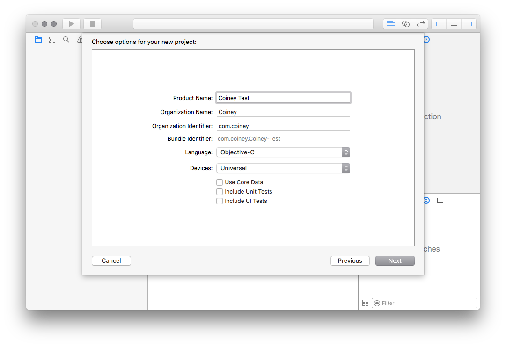

# Introduction to CoineyKit

## What we are going to create

If you follow along this tutorial, you will learn how to create a basic application, that allows the user to accept Credit Card payments using the Coiney Credit Card Reader.

## What you need

 * CoineyKit
 * Xcode 5 or above (Installed in `/Applications`)
 

## Setting up your project

Begin by launching Xcode and creating a new project: `File → New → Project`. In the dialog that appears, Choose the `Single View Application` template. And enter project options as per the screenshot below.

Now that your project is created, copy the folder `CoineyKit` to your project folder, resulting in path of `<Your project folder>/CoineyKit` .

The next step is to add `CoineyKitResources.bundle` and `CoineyKit.framework` to your project.

Now you're almost ready to make use of CoineyKit, you just need to update your build settings to use CoineyKit.xcconfig, as shown in the above screenshot.

## Making our first payment

Open up `CTViewController.h` and make it look like:

    #import <UIKit/UIKit.h>
    
    @interface CTViewController : UIViewController
    - (IBAction)makePayment:(id)aSender;
    @end
    
And `CTViewController.m`:

    #import "CTViewController.h"
    @import CoineyKit;
    
    @implementation CTViewController
    
    - (IBAction)makePayment:(id)aSender
    {
        CYCoineyViewController * const coineyController = [CYCoineyViewController new];
        [self presentViewController:coineyController animated:YES completion:nil];
    }
    
    @end
    

This is all that's required for the most basic use case. We just need to hook up a button to our `makePayment:` method, and we're ready to go.

Now if we run the application it should appear like below:

## Do something a little more realistic

When embedding CoineyKit in your application, you'll most likely want to tell CoineyKit what products you are charging for, and to be notified once the user completes or cancels the payment. Good news: this is trivial to do, simply augment `CTViewController.*` like below:

`CTViewController.h`:

    #import <UIKit/UIKit.h>
    
    @interface CTViewController : UIViewController
    @property(weak, nonatomic) IBOutlet UITextField *productNameField, *productPriceField;
    
    - (IBAction)makePayment:(id)aSender;
    @end

`CTViewController.m`:

    #import "CTViewController.h"
    @import CoineyKit;
    
    @implementation CTViewController
    
    - (IBAction)makePayment:(id)aSender
    {
        // Create a line item to pre-populate the Coiney controller with.
        NSString *name = _productNameField.text;
        int price = [_productPriceField.text intValue];
        
        CYLineItem *lineItem = [CYLineItem itemWithAmount:price
                                                 currency:CYCurrencyJPY name:name];
        
        // Create an instance of the Coiney payment controller.
        CYCoineyViewController * coineyController = [[CYCoineyViewController alloc] initWithLineItems:@[lineItem]];
        
        // Present it on top of the current controller.
        [self presentViewController:coineyController animated:YES completion:nil];
    }
    
    @end
    
If you now hook up `productNameField` & `productPriceField` to text fields in CTViewController.xib, we will have a functional product input form.

## Get notified of the transaction status

To know the status of the transaction you simply make yourself the delegate of your Coiney controller, and it will notify you of its progress.

`CTViewController.m`:

    #import "CTViewController.h"
    @import CoineyKit;
    
    @interface CTViewController () <CYCoineyViewControllerDelegate>
    @end
    
    @implementation CTViewController
    
    - (IBAction)makePayment:(id)aSender
    {
        // Create a line item to pre-populate the Coiney controller with.
        NSString *name = _productNameField.text;
        NSInteger price = [_productPriceField.text integerValue];
        
        CYLineItem *lineItem = [CYLineItem itemWithAmount:price
                                                 currency:CYCurrencyJPY 
                                                     name:name];
        
        // Create an instance of the Coiney payment controller.
        CYCoineyViewController * coineyController = [[CYCoineyViewController alloc] initWithLineItems:@[lineItem]];
        coineyController.delegate = self;
        // Present it on top of the current controller.
        [self presentViewController:coineyController animated:YES completion:nil];
    }
    
    - (void)coineyViewController:(CYCoineyViewController *)aController
          didCompleteTransaction:(id<CYTransaction>)aTransaction
    {
        NSLog(@"Completed transaction!: %@", aTransaction);
    }
    
    - (void)coineyViewControllerDidCancel:(CYCoineyViewController *)aController
    {
    	[aController dismissViewControllerAnimated:YES completion:nil];
        NSLog(@"Cancelled payment.");
    }

    
## Show the details of a transaction

You can use a transaction ID to bring up its detail view.  The view can contain a refund button if refunding should be allowed.

`CTViewController.m`:

    #import "CTViewController.h"
    @import CoineyKit;
    
    @interface CTViewController () <CYCoineyViewControllerDelegate>
    @end
    
    @implementation CTViewController
    
    - (IBAction)makePayment:(id)aSender
    {
        // Create a line item to pre-populate the Coiney controller with.
        NSString *name = _productNameField.text;
        int price = [_productPriceField.text intValue];
        
        CYLineItem *lineItem = [CYLineItem itemWithAmount:price
                                                 currency:CYCurrencyJPY name:name];
        
        // Create an instance of the Coiney payment controller.
        CYCoineyViewController * coineyController = [[CYCoineyViewController alloc] initWithLineItems:@[lineItem]];
        coineyController.delegate = self;
        // Present it on top of the current controller.
        [self presentViewController:coineyController animated:YES completion:nil];
    }
    
    - (void)coineyViewController:(CYCoineyViewController *)aController
          didCompleteTransaction:(id<CYTransaction>)aTransaction
    {
        NSLog(@"Completed transaction: %@", aTransaction);
    
        [aController dismissViewControllerAnimated:YES completion:nil];
        
        CYTransactionViewController *transactionViewController =
	        [CYTransactionViewController transactionViewControllerWithTransaction:aTransaction
	                                                               allowRefunding:YES]; // Pass NO to hide the refund button
	    // Add a navigation controller to your storyboard to make this work
        [self.navigationController pushViewController:transactionViewController animated:YES];
    }

After making a payment and tapping Done, you will see a `CYTransactionViewController` showing the details of the transaction.  (You'll need to add a navigation controller to your test app to run the above snippet.)

## Looking up a transaction

You can use a transaction's unique identifier to query Coiney for the corresponding CYTransaction object.

    CYLookUpTransaction(transactionIdentifier, ^(id<CYTransaction> transaction, NSError *err) {
    	if(transaction)
    		NSLog(@"Transaction found: %@", transaction);
    	else
    		NSLog(@"Transaction not found: %@", err);
    });

## And that's it!

If you have any further questions feel free to email <devsupport@coiney.com>.