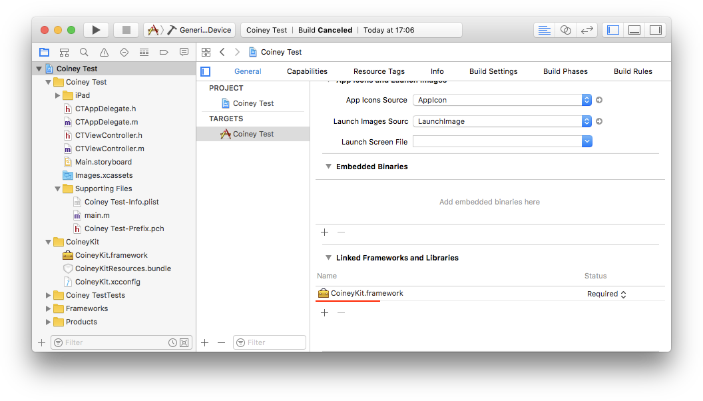

[](https://travis-ci.com/Coiney-SDK/CoineyKit-iOS)

# CoineyKit

CoineyKit をご利用いただき、ありがとうございます。ご要望やバグ報告の際は、お手数ですが [GitHub issue](https://github.com/Coiney-SDK/CoineyKit-iOS/issues) を作成いただきますようお願い致します。

-------

# サンプルアプリ

## 目的

このチュートリアルでは、CoineyKitを使って、カード決済ができるサンプルアプリを作成します。

(完成したものが `Example/` 配下にあります)

## 必要なもの

あらかじめ [git-lfs](https://git-lfs.github.com) をインストールし、 `git lfs install` を実行してください。git-lfs がないと、リポジトリを正しくクローンできません。

 * CoineyKit (このリポジトリを `git clone` してください)
 * Xcode 9
 * Coineyターミナル (購入については、 <coineykitsupport@coiney.com> までお問い合わせください)

## プロジェクトのセットアップ

Xcode を起動し、`File → New → Project` から、`Single View Application` を選択します。


下記のように設定します。


本リポジトリを `git clone` し、`CoineyKit` フォルダを、`«プロジェクトフォルダ»/CoineyKit` となるように、プロジェクトフォルダの中へコピーします。


Git をお使いでしたら、更新しやすいように、submodule として追加することをお勧めします。

`CoineyKit.xcconfig` と `CoineyKitResources.bundle` を、Xcode のプロジェクトナビゲーターにドラッグ＆ドロップします。

次に、Debug・Release 両方の configuration に "CoineyKit" を指定してください。


ターゲットの General 設定を開き、`CoineyKit.framework` および下記ライブラリをリンクするようにします。

 * libxml2.tbd
 * libstdc++.tbd
 * libsqlite3.tbd



もう少しでセットアップは完了です。

#### Info.plist への追加

BluetoothでCoineyターミナルに接続し、ICや磁気カード決済をするために、`UISupportedExternalAccessoryProtocols` をInfo.plistへ追加する必要があります。

```
<key>UISupportedExternalAccessoryProtocols</key>
<array>
  <string>com.coiney.Coiney</string>
</array>
```

## 決済をする

### Objective-C

`ViewController.h` と `ViewController.m` を開き、下記のコードを貼り付けてください。

#### ViewController.h

    #import <UIKit/UIKit.h>
    
    @interface ViewController : UIViewController
    @property(weak, nonatomic) IBOutlet UITextField *productMemoField, *productPriceField;
    
    - (IBAction)makePayment:(id)aSender;
    @end

#### ViewController.m

    #import "ViewController.h"
    @import CoineyKit;

    @implementation ViewController

    - (IBAction)makePayment:(id)aSender
    {
        NSString *memo = _productMemoField.text;
        int price = [_productPriceField.text intValue];
    
        // CYCoineyViewController のインスタンスを作成
        CYCoineyViewController * coineyController = [[CYCoineyViewController alloc] initWithAmount:price memo:memo];
    
        // ViewController の上に表示
        [self presentViewController:coineyController animated:YES completion:nil];
    }
    @end

    
### Swift

#### ViewController.swift

    import UIKit
    import CoineyKit
    
    class ViewController: UIViewController {
    
        @IBOutlet weak var memoField: UITextField!
        @IBOutlet weak var amountField: UITextField!
        
        @IBAction func makePayment(sender: AnyObject) 
        {
            let memo = productNameField.text ?? ""
            let amount = Int64(productPriceField.text!) ?? 0
            
            // CYCoineyViewController のインスタンスを作成
            guard let coineyController = CYCoineyViewController.init(amount: amount, memo: memo) else {
                fatalError("Failed to initialize CYCoineyViewController.")
            }
            
            // ViewController の上に表示
            self.present(coineyController, animated: true, completion: nil)
        }
    }
    
`Main.storyboard` でボタンを作り、押されたら `makePayment:` が呼び出されるようにしてください。`productNameField` と `productPriceField` はそれぞれ `IBOutlet` をフィールドにつなげてください。


iPhone で実行すると、下記のようになります。


あとはターミナルを繋げば決済できます。ターミナルへ接続するには、ナビゲーションバー右側のターミナル情報ボタンをタップし、[ターミナルに接続する] をタップしてください。

## 結果の通知を受け取る

### Objective-C

デリゲートメソッドを使って、決済完了時とキャンセル時に通知を受け取ることができます。下記のように、`ViewController.m` に `CYCoineyViewControllerDelegate` プロトコルを実装させ、`coineyViewController:didCompleteTransaction:` および `coineyViewControllerDidCancel:` を実装してください。

#### ViewController.m

    #import "ViewController.h"
    @import CoineyKit;
    
    @interface ViewController () <CYCoineyViewControllerDelegate>
    @end
    
    @implementation ViewController
    
    - (IBAction)makePayment:(id)aSender
    {
	    NSString *memo = _productNameField.text;
	    NSInteger amount = [_productPriceField.text integerValue];
	
	    // CYCoineyViewController のインスタンスを作成
	    CYCoineyViewController * coineyController = [[CYCoineyViewController alloc] initWithAmount:amount memo:memo];
	    coineyController.delegate = self;
	    
	    // ViewController の上に表示
	    [self presentViewController:coineyController animated:YES completion:nil];
    }
    
    - (void)coineyViewController:(CYCoineyViewController *)aController
          didCompleteTransaction:(id<CYTransaction>)aTransaction
    {
        NSLog(@"Completed transaction: %@", aTransaction);
    }
    
    - (void)coineyViewControllerDidCancel:(CYCoineyViewController *)aController
    {
        [aController dismissViewControllerAnimated:YES completion:nil];
        NSLog(@"Cancelled payment.");
    }
    @end

### Swift

#### ViewController.swift

    import UIKit
    import CoineyKit

    class ViewController: UIViewController {
    
        @IBOutlet weak var memoField: UITextField!
        @IBOutlet weak var amountField: UITextField!
    
        @IBAction func makePayment(sender: AnyObject) {
	        let memo = productNameField.text ?? ""
	        let amount = Int64(productPriceField.text!) ?? 0
	        
	        // CYCoineyViewController のインスタンスを作成
	        guard let coineyController = CYCoineyViewController.init(amount: amount, memo: memo) else {
	            fatalError("Failed to initialize CYCoineyViewController.")
	        }
	        coineyController.delegate = self
	        
	        // ViewController の上に表示
	        self.present(coineyController, animated: true, completion: nil)
        }
    }
    
    extension ViewController : CYCoineyViewControllerDelegate {
    
        func coineyViewController(_ aController: CYCoineyViewController!,
                                  didComplete aTransaction: CYTransaction!) {
            print("Completed transaction: \(aTransaction)")
        }
    
        func coineyViewControllerDidCancel(_ aController: CYCoineyViewController!) {
            self.dismiss(animated: true, completion: nil)
            print("Cancelled payment.")
        }
    }
    
## 取引詳細の表示・売上取消

取引 ID をもとに、取引の詳細画面を表示できます。画面上のボタンで、売上取消・返品処理をおこなえます。ボタンは、`allowRefunding` パラメーターにNOを渡すことで、押せなくすることもできます。

下記の場合は、パラメーターにかかわらず、売上取消・返品ボタンが無効となります。ご注意ください。

* スタッフアカウントでログインしている（オーナー、マネージャーのみ取消できます）
* 既に売上取消・返品済み

また、60日以上経過している取引は、ボタンを押すとエラーとなり、取消できません。

### Objective-C

#### ViewController.m

    #import "ViewController.h"
    @import CoineyKit;
    
    @interface ViewController () <CYCoineyViewControllerDelegate>
    @end
    
    @implementation ViewController
    
    - (IBAction)makePayment:(id)aSender
    {
	    NSString *memo = _productNameField.text;
	    NSInteger amount = [_productPriceField.text integerValue];
	
	    // CYCoineyViewController のインスタンスを作成
	    CYCoineyViewController * coineyController = [[CYCoineyViewController alloc] initWithAmount:amount memo:memo];
	    coineyController.delegate = self;
	    
	    // ViewController の上に表示
	    [self presentViewController:coineyController animated:YES completion:nil];
    }
    
    - (void)coineyViewController:(CYCoineyViewController *)aController
          didCompleteTransaction:(id<CYTransaction>)aTransaction
    {
        NSLog(@"Completed transaction: %@", aTransaction);
        
        [aController dismissViewControllerAnimated:YES completion:^{
            CYTransactionViewController *transactionViewController =
                [CYTransactionViewController transactionViewControllerWithTransaction:aTransaction
                                                                       allowRefunding:YES];
                                                                       // 売上取消・返品不可にするには、NOを渡す
            transactionViewController.navigationItem.rightBarButtonItem =
                [[UIBarButtonItem alloc] initWithBarButtonSystemItem:UIBarButtonSystemItemDone
                                                              target:self
                                                              action:@selector(done:)];
            UINavigationController *navigationController =
                [[UINavigationController alloc] initWithRootViewController:transactionViewController];
            [navigationController setModalPresentationStyle:UIModalPresentationFormSheet];
            [self presentViewController:navigationController
                               animated:YES
                             completion:nil];
	     }];
    }
    
    - (void)done:(id)aSender
    {
    	[self dismissViewControllerAnimated:YES completion:nil];
    }
    @end

### Swift

#### ViewController.swift

    import UIKit
    import CoineyKit

    class ViewController: UIViewController {
        
        @IBOutlet weak var memoField: UITextField!
        @IBOutlet weak var amountField: UITextField!
    
        @IBAction func makePayment(sender: AnyObject) {
	        let memo = productNameField.text ?? ""
	        let amount = Int64(productPriceField.text!) ?? 0
	        
	       // CYCoineyViewController のインスタンスを作成
	        guard let coineyController = CYCoineyViewController.init(amount: amount, memo: memo) else {
	            fatalError("Failed to initialize CYCoineyViewController.")
	        }
	        coineyController.delegate = self
	        
	        // ViewController の上に表示
	        self.present(coineyController, animated: true, completion: nil)
        }
        
        func done() {
        	self.dismiss(animated: true, completion: nil)
        }
    }
    
    extension ViewController : CYCoineyViewControllerDelegate {
    
        func coineyViewController(_ aController: CYCoineyViewController!,
                                  didComplete aTransaction: CYTransaction!) {
            print("Completed transaction: \(aTransaction)")
            
            self.dismiss(animated: true, completion: {
	            guard let transactionViewController =
	                CYTransactionViewController.init(transaction: aTransaction, allowRefunding: true) else {
	                    // 売上取消・返品不可にするには、allowRefunding: falseを渡す
	                    fatalError("Failed to initialize CYTransactionViewController.")
	            }
	            
	            transactionViewController.navigationItem.rightBarButtonItem =
	                UIBarButtonItem.init(barButtonSystemItem: .done,
	                                     target: self,
	                                     action: #selector(self.done))
	            
	            let navigationController = UINavigationController.init(rootViewController: transactionViewController)
	            navigationController.modalPresentationStyle = .formSheet
	            self.present(navigationController, animated: true, completion: nil)
	        })
        }
    }

上記コードを実行すると、決済完了後、取引詳細が表示されます。


## 取引履歴の参照

取引履歴から `CYTransaction` オブジェクトを取得するには、`CYLookUpTransaction()` を使います。

### Objective-C

    CYLookUpTransaction(transactionIdentifier, ^(id<CYTransaction> transaction, NSError *err) {
        if(transaction)
            NSLog(@"Transaction found: %@", transaction);
            CYTransactionViewController *transactionViewController =
                [CYTransactionViewController transactionViewControllerWithTransaction:transaction
                                                                       allowRefunding:YES];
                                                                          
            transactionViewController.navigationItem.rightBarButtonItem =
                [[UIBarButtonItem alloc] initWithBarButtonSystemItem:UIBarButtonSystemItemDone   
                                                              target:self
                                                              action:@selector(done:)];
            UINavigationController *navigationController = [UINavigationController new];
            navigationController.viewControllers = @[transactionViewController];
            [navigationController setModalPresentationStyle:UIModalPresentationFormSheet];
            [self presentViewController:navigationController animated:YES completion:nil];
        }
        else
            NSLog(@"Transaction not found: %@", err);
    });
    
    ...
    
    - (void)done:(id)aSender
    {
        [self dismissViewControllerAnimated:YES completion:nil];
    }

### Swift

    CYLookUpTransaction(transactionIdentifier, { aTransaction, aError in
        if let transaction = aTransaction {
            guard let transactionViewController =
                CYTransactionViewController.init(transaction: transaction, allowRefunding: true) else {
                    fatalError("Failed to initialize CYTransactionViewController.")
            }
            
            transactionViewController.navigationItem.rightBarButtonItem =
                UIBarButtonItem.init(barButtonSystemItem: .done,
                                     target: self,
                                     action: #selector(self.done))
            
            let navigationController = UINavigationController.init(rootViewController: transactionViewController)
            navigationController.modalPresentationStyle = .formSheet
            self.present(navigationController, animated: true, completion: nil)
        } else if let error = aError {
            print("Transaction not found: \(error)")
        }
    })
    
    ...
    
    func done() {
        self.dismiss(animated: true, completion: nil)
    }

## レシート印刷

印刷機能をオンにすると、決済完了画面および取引詳細画面に [レシートを印刷] ボタンが表示され、レシートを印刷できます。デフォルトはオフです。

レシートを印刷するには:

1. アプリ起動時に `CYEnablePrinting(YES)` を呼びます。
2. アプにのInfo.plistに、以下のExternal Accessory Protocolsを追加します。

```
<key>UISupportedExternalAccessoryProtocols</key>
<array>
  <string>com.coiney.Coiney</string><!--コイニーターミナル-->
  <string>com.sii-ps.siieap</string>
  <string>com.epson.escpos</string>
  <string>jp.star-m.starpro</string>
</array>
```

3. iPadまたはiPhoneのBluetooth設定から、対応プリンターとペアリングします。対応機種はcoiney.comをご参照ください。

注1: BLE接続のスター精密SM-L200につきましては、現在CoineyKitでは非対応です。

注2: 自社アプリでレシート印刷を実装する場合は、 `CYEnablePrinting(YES)` を呼ばないでください。 `EASession` をCoineyKitと共有できないためです。

## App Review への申請

Apple のアプリ審査を受けるにあたり、Coiney ターミナルの MFi 認証が必要になります。[こちら](../../wiki/PPID-の申請) のページをご覧ください。

## お問い合わせ

ご質問・ご要望等は、<coineykitsupport@coiney.com> までお問い合わせください。
