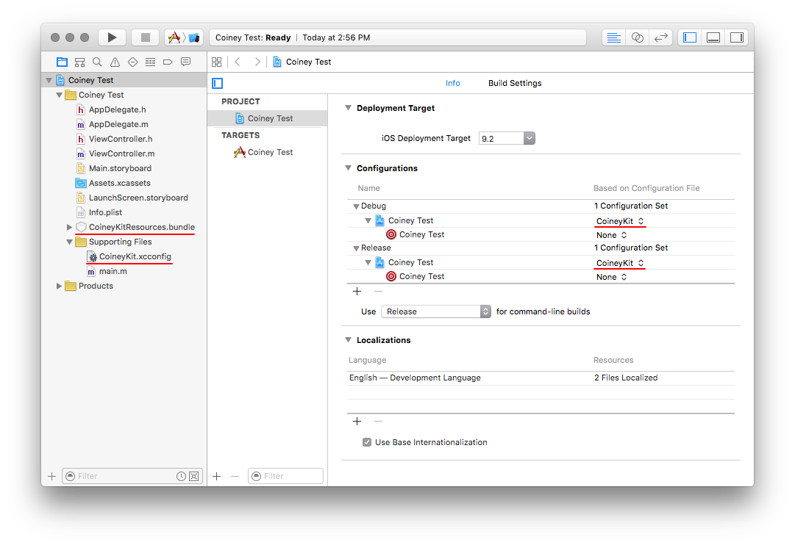

# CoineyKit

CoineyKit をご利用いただき、ありがとうございます。ご要望やバグ報告の際は、お手数ですが [GitHub issue](https://github.com/Coiney/CoineyKit-iOS/issues) を作成いただきますようお願い致します。

-------

# サンプルアプリ

## 目的

このチュートリアルでは、CoineyKitを使って、カード決済ができるサンプルアプリを作成します。

(完成したものが、`Example/Coiney Test.xcodeproj` にあります)

## 必要なもの

 * CoineyKit (このレポジトリを `git clone`、または .zip 形式でダウンロードしてください)
 * Xcode 7 以上
 * Coineyターミナル (購入については、 <coineykit-support@coiney.com> までお問い合わせください)
 

## プロジェクトのセットアップ

Xcode を起動し、`File → New → Project` から、`Single View Application` を選択します。


下記のように設定します。


本レポジトリを `git clone` またはダウンロードし、`CoineyKit` フォルダを、`«プロジェクトフォルダ»/CoineyKit` となるように、プロジェクトフォルダの中へコピーします。


Git をお使いでしたら、更新しやすいように、submodule として追加することをお勧めします。

`CoineyKit.xcconfig` と `CoineyKitResources.bundle` を、Xcode のプロジェクトナビゲーターにドラッグ＆ドロップします。

次に、Debug・Release 両方の configuration に "CoineyKit" を指定してください。



ターゲットの General 設定を開き、`CoineyKit.framework` および下記ライブラリをリンクするようにします。

 * libxml2.tbd
 * libsqlite3.tbd


もう少しでセットアップは完了です。

#### Info.plist への追加

BluetoothでCoineyターミナルに接続し、ICや磁気カード決済をするために、`UISupportedExternalAccessoryProtocols` をInfo.plistへ追加する必要があります。

```
<key>UISupportedExternalAccessoryProtocols</key>
<array>
  <string>com.coiney.Coiney</string>
</array>
```

iOS 9 の App Transport Security に対応するために、`NSAppTransportSecurity` を追加してください。

```
<key>NSAppTransportSecurity</key>
<dict>
  <key>NSExceptionDomains</key>
  <dict>
    <key>coiney.com</key>
    <dict>
      <key>NSExceptionAllowsInsecureHTTPLoads</key>
      <true/>
      <key>NSIncludesSubdomains</key>
      <true/>
    </dict>
  </dict>
</dict>
```

今後すべてのリンクを https にしていくため、将来的に不要になる予定です。http で取得しているのは、利用規約などの静的ページのみです。決済に携わる通信には https を使っておりますので、安心してご利用いただけます。

## 決済をする

### Objective-C

`ViewController.h` と `ViewController.m` を開き、下記のコードを貼り付けてください。

#### ViewController.h

    #import <UIKit/UIKit.h>
    
    @interface ViewController : UIViewController
    @property(weak, nonatomic) IBOutlet UITextField *productMemoField, *productPriceField;
    
    - (IBAction)makePayment:(id)aSender;
    @end

#### ViewController.m

    #import "ViewController.h"
    @import CoineyKit;

    @implementation ViewController

    - (IBAction)makePayment:(id)aSender
    {
        // CYCoineyController に渡す CYItem を作成
        NSString *memo = _productMemoField.text;
        int price = [_productPriceField.text intValue];
    
        CYItem *item = [CYItem itemWithTotal:price
                                    currency:CYCurrencyJPY
                                        memo:memo];
    
        // CYCoineyViewController のインスタンスを作成
        CYCoineyViewController * coineyController = [[CYCoineyViewController alloc] initWithLineItems:@[item]];
    
        // ViewController の上に表示
        [self presentViewController:coineyController animated:YES completion:nil];
    }
    @end
    
### Swift

#### ViewController.swift

    import UIKit
    import CoineyKit
    
    class ViewController: UIViewController {
        @IBOutlet var memoField: UITextField?
        @IBOutlet var amountField: UITextField?
        
        @IBAction func makePayment(sender: AnyObject) {
            let amount: UInt? = amountField == nil ? nil : UInt(amountField!.text!)
            if (amount != nil) {
                let coineyController: CYCoineyViewController = CYCoineyViewController(amount, memo: memo)
                self.presentViewController(coineyController, animated: true, completion: nil)
            }
        }
    }
    
`Main.storyboard` でボタンを作り、押されたら `makePayment:` が呼び出されるようにしてください。`productNameField` と `productPriceField` はそれぞれ `IBOutlet` をフィールドにつなげてください。


iPhone で実行すると、下記のようになります。


あとはターミナルを繋げば決済できます。ターミナルへ接続するには、ナビゲーションバー右側のターミナル情報ボタンをタップし、[ターミナルに接続する] をタップしてください。

## 結果の通知を受け取る

### Objective-C

デリゲートメソッドを使って、決済完了時とキャンセル時に通知を受け取ることができます。下記のように、`ViewController.m` に `CYCoineyViewControllerDelegate` プロトコルを実装させ、`coineyViewController:didCompleteTransaction:` および `coineyViewControllerDidCancel:` を実装してください。

#### ViewController.m

    #import "ViewController.h"
    @import CoineyKit;
    
    @interface ViewController () <CYCoineyViewControllerDelegate>
    @end
    
    @implementation ViewController
    
    - (IBAction)makePayment:(id)aSender
    {
        NSString *memo = _productMemoField.text;
        NSInteger price = [_productPriceField.text integerValue];
        
        // Create an instance of the Coiney payment controller.
        CYCoineyViewController * coineyController = [[CYCoineyViewController alloc] initWithAmount:price memo:memo];
        coineyController.delegate = self;
        // Present it on top of the current controller.
        [self presentViewController:coineyController animated:YES completion:nil];
    }
    
    - (void)coineyViewController:(CYCoineyViewController *)aController
          didCompleteTransaction:(id<CYTransaction>)aTransaction
    {
        NSLog(@"Completed transaction: %@", aTransaction);
    }
    
    - (void)coineyViewControllerDidCancel:(CYCoineyViewController *)aController
    {
        [aController dismissViewControllerAnimated:YES completion:nil];
        NSLog(@"Cancelled");
    }
    @end
    
### Swift

#### ViewController.swift

    import UIKit
    import CoineyKit

    class ViewController: UIViewController, CYCoineyViewControllerDelegate {
        @IBOutlet var memoField: UITextField?
        @IBOutlet var amountField: UITextField?
    
        @IBAction func makePayment(sender: AnyObject) {
            let amount: UInt? = amountField == nil ? nil : UInt(amountField!.text!)
            if (amount != nil) {
                let item: CYItem = CYItem(total: amount!, currency: .JPY, memo: memoField?.text)
                let coineyController: CYCoineyViewController = CYCoineyViewController(lineItems: [item])
                coineyController.delegate = self
                self.presentViewController(coineyController, animated: true, completion: nil)
            }
        }
    
        func coineyViewController(aController: CYCoineyViewController!,
             didCompleteTransaction aTransaction: CYTransaction!) {
            print("Completed transaction: \(aTransaction)")
        }
    
        func coineyViewControllerDidCancel(aController: CYCoineyViewController!) {
            self.dismissViewControllerAnimated(true, completion: nil)
            print("Cancelled")
        }
    }
    
## 取引詳細の表示・売上取消

取引 ID をもとに、取引の詳細画面を表示できます。画面上のボタンで、売上取消・返品処理をおこなえます。ボタンは、パラメーターで非表示にすることもできます。

下記の場合は、パラメーターにかかわらず、売上取消・返品ボタンが表示されません。ご注意ください。

* スタッフアカウントでログインしている（オーナー、マネージャーのみ取消できます）
* 既に売上取消・返品済み

### Objective-C

#### ViewController.m

    #import "ViewController.h"
    @import CoineyKit;
    
    @interface ViewController () <CYCoineyViewControllerDelegate>
    @end
    
    @implementation ViewController
    
    - (IBAction)makePayment:(id)aSender
    {
        NSString *memo = _productMemoField.text;
        int price = [_productPriceField.text intValue];
        
        CYItem *item = [CYItem itemWithTotal:price
                                        currency:CYCurrencyJPY
                                            memo:memo];
        CYCoineyViewController * coineyController = [[CYCoineyViewController alloc] initWithLineItems:@[item]];
        coineyController.delegate = self;
        [self presentViewController:coineyController animated:YES completion:nil];
    }
    
    - (void)coineyViewController:(CYCoineyViewController *)aController
          didCompleteTransaction:(id<CYTransaction>)aTransaction
    {
        NSLog(@"Completed transaction: %@", aTransaction);
        
        [aController dismissViewControllerAnimated:YES completion:^{
            CYTransactionViewController *transactionViewController =
                [CYTransactionViewController transactionViewControllerWithTransaction:aTransaction
                                                                       allowRefunding:YES];
                                                              // 売上取消・返品ボタンを非表示にするには、NO を渡してください
            transactionViewController.navigationItem.rightBarButtonItem =
	        [[UIBarButtonItem alloc] initWithBarButtonSystemItem:UIBarButtonSystemItemDone
                                                              target:self
                                                              action:@selector(done:)];
            UINavigationController *navigationController =
                [[UINavigationController alloc] initWithRootViewController:transactionViewController];
            [navigationController setModalPresentationStyle:UIModalPresentationFormSheet];
            [self presentViewController:navigationController
                               animated:YES
                             completion:nil];
	    }];
    }
    
    - (void)done:(id)aSender
    {
        [self dismissViewControllerAnimated:YES completion:nil];
    }
    @end
    
### Swift

#### ViewController.swift

    import UIKit
    import CoineyKit

    class ViewController: UIViewController, CYCoineyViewControllerDelegate {
        @IBOutlet var memoField: UITextField?
        @IBOutlet var amountField: UITextField?
    
        @IBAction func makePayment(sender: AnyObject) {
            let amount: UInt? = amountField == nil ? nil : UInt(amountField!.text!)
            if (amount != nil) {
                let item: CYItem = CYItem(total: amount!, currency: .JPY, memo: memoField?.text)
                let coineyController: CYCoineyViewController = CYCoineyViewController(lineItems: [item])
                coineyController.delegate = self
                self.presentViewController(coineyController, animated: true, completion: nil)
            }
        }
    
        func coineyViewController(aController: CYCoineyViewController!,
            didCompleteTransaction aTransaction: CYTransaction!) {                                
            self.dismissViewControllerAnimated(true) { () -> Void in
                let transactionController = CYTransactionViewController(transaction: aTransaction,
                    allowRefunding: true)
                transactionController.navigationItem.rightBarButtonItem =
                    UIBarButtonItem(barButtonSystemItem: .Done, target: self, action: "done")
                let navigationController = UINavigationController(rootViewController: transactionController)
                navigationController.modalPresentationStyle = .FormSheet
                self.presentViewController(navigationController, animated: true, completion: nil)
            }
        }
    
        func done() {
            self.dismissViewControllerAnimated(true, completion: nil)
        }
    }

上記コードを実行すると、決済完了後、取引詳細が表示されます。


## 取引履歴の参照

取引履歴から `CYTransaction` オブジェクトを取得するには、`CYLookUpTransaction()` を使います。

### Objective-C

    CYLookUpTransaction(transactionIdentifier, ^(id<CYTransaction> transaction, NSError *err) {
        if(transaction)
            NSLog(@"Transaction found: %@", transaction);
            CYTransactionViewController *transactionViewController =
                [CYTransactionViewController transactionViewControllerWithTransaction:transaction
                                                                       allowRefunding:YES];
                                                                          
            transactionViewController.navigationItem.rightBarButtonItem =
                [[UIBarButtonItem alloc] initWithBarButtonSystemItem:UIBarButtonSystemItemDone   
                                                              target:self
                                                              action:@selector(done:)];
            UINavigationController *navigationController = [UINavigationController new];
            navigationController.viewControllers = @[transactionViewController];
            [navigationController setModalPresentationStyle:UIModalPresentationFormSheet];
            [self presentViewController:navigationController animated:YES completion:nil];
        }
    	else
    		NSLog(@"Transaction not found: %@", err);
    });
    
    ...
    
    - (void)done:(id)aSender
    {
        [self dismissViewControllerAnimated:YES completion:nil];
    }
    
### Swift

    CYLookUpTransaction(transactionIdentifier, { (transaction, error) -> Void in
        if error != nil {
            print("Transaction not found: \(error)")
        } else {
            let transactionController = CYTransactionViewController(transaction: transaction, allowRefunding: true)
            transactionController.navigationItem.rightBarButtonItem =
                UIBarButtonItem(barButtonSystemItem: .Done, target: self, action: "done")
            let navigationController = UINavigationController(rootViewController: transactionController)
            navigationController.modalPresentationStyle = .FormSheet
            self.presentViewController(navigationController, animated: true, completion: nil)
        }
    })
    
    ...
    
    func done() {
        self.dismissViewControllerAnimated(true, completion: nil)
    }

## レシート印刷

印刷機能をオンにすると、決済完了画面および取引詳細画面に [レシートを印刷] ボタンが表示され、レシートを印刷できます。デフォルトはオフです。

レシートを印刷するには:

1. アプリ起動時に `CYEnablePrinting(YES)` を呼びます。
2. iPadまたはiPhoneのBluetooth設定から、対応プリンターとペアリングします。対応機種はcoiney.comをご参照ください。

注1: BLE接続のスター精密SM-L200につきましては、現在CoineyKitでは非対応です。

注2: 自社アプリでレシート印刷を実装する場合は、 `CYEnablePrinting(YES)` を呼ばないでください。 `EASession` をCoineyKitと共有できないためです。

## App Review への申請

Apple のアプリ審査を受けるにあたり、Coiney ターミナルの MFi 認証が必要になります。[こちら](../../wiki/PPID-の申請) のページをご覧ください。

## お問い合わせ

ご質問・ご要望等は、<coineykit-support@coiney.com> までお問い合わせください。
