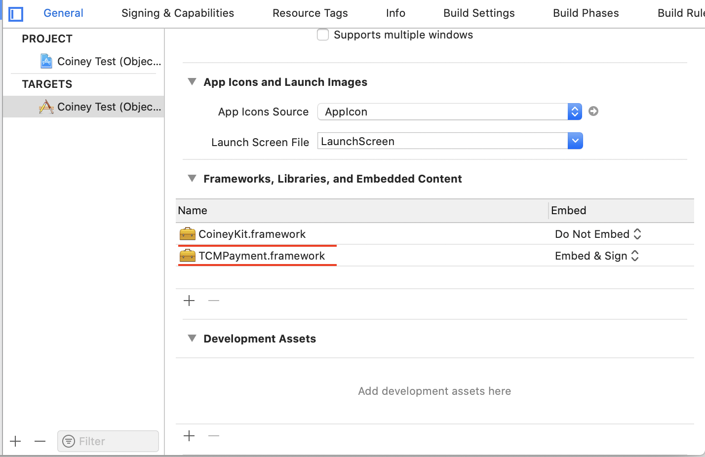
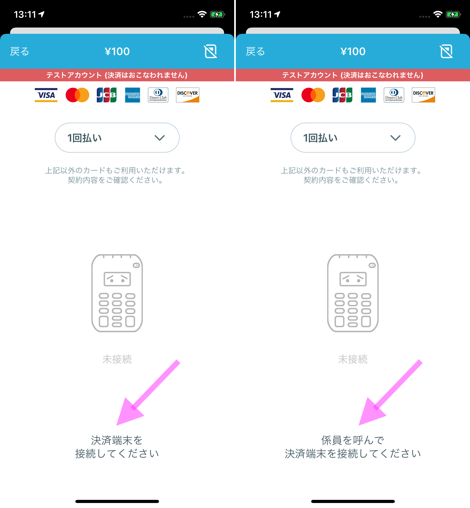
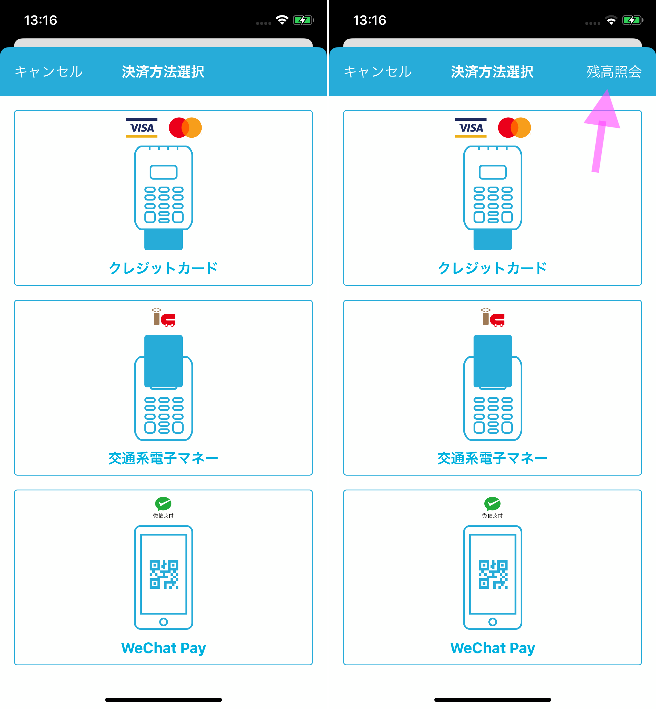
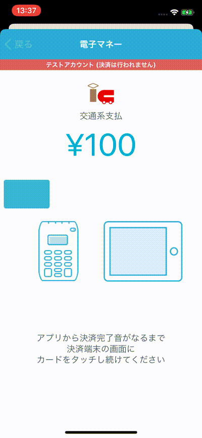

# CoineyKit

Thanks for showing interest in CoineyKit. We work hard to make it as easy to integrate as possible, but if you have any issues at all, please create a ticket using our [Issue Tracker](https://github.com/Coiney-SDK/CoineyKit-iOS/issues).

If you have any further questions feel free to email < coineykitsupport@coiney.com >.

****

- [Announcement](#announcement)
- [CoineyKit API Document](#coineykit-api-document)
- [Example Application](#example-application)
  - [What we are going to create](#what-we-are-going-to-create)
  - [What you need](#what-you-need)
  - [Setting up your project](#setting-up-your-project)
  - [Initialization of SDK](#initialization-of-sdk)
  - [Making our first payment](#making-our-first-payment)
  - [Get notified of the transaction status](#get-notified-of-the-transaction-status)
  - [Show the details of a transaction](#show-the-details-of-a-transaction)
  - [Looking up a transaction](#looking-up-a-transaction)
  - [Receipt Printing](#receipt-printing)
  - [Send Receipt via E-Mail](#send-receipt-via-e-mail)
- [About semi-self checkout mode](#about-semi-self-checkout-mode )
- [Submitting Your App for Review](#submitting-your-app-for-review)
- [Contact Us](#contact-us)


## Announcement

### SDK Semi-self checkout Support Release (2021-08-31)

With the STORES Payments SDK, it is now possible to support Semi-self checkout for e-money payments.
* Full self-checkout (unmanned checkout, etc.) is not supported.
Please check [here](https://hey.jp/news/info/2021-08-31-selfsdk.html) for detailed explanations and contact us if you have any questions.

****

### STORES Payment is Dropping Support for iOS 11 and below（ 2021-03-03 ）
We're discontinuing support for iOS 11 and older to improve our service and safety.

````
- Drop OS Version
  iOS11 and older

- Support End Date
  March 31, 2021
````

Please use iOS 12 or later from now on.


### Announcement of Merger ( 2021-01-01 )
I would like to inform you that we will be mergered with parent company hey Inc.
The service management company will be unified into hey Inc.


### Service Name Change from STORES Terminal to STORES Payments ( 2020-11-27 )

Starting November 27, 2020, Coiney Inc. will change the name of its cashless store service, STORES Terminal, to STORES Payments.

The SDK will be renamed to "STORES Payments SDK" in a future release, but the latest version of the SDK will continue to be available as "CoineyKit".


### SDK E-money Payment Support Release (2020-07-07)

The STORES Terminal SDK (formerly CoineyKit) now supports e-money as a payment option. ※ The e-money payment option will not be available for semi-self and self-checkout systems.

**1. E-money payment guidelines**
- The transaction amount must be between 100 yen and 20,000 yen.

- E-money payments cannot be refunded through the SDK. To refund an e-money payment, please refund via cash.

- Please install the STORES Terminal app to perform the following e-money operations:
  - Checking the balance on a transit IC card (i.e. Suica, PASMO)
  - Checking the status of unconfirmed transactions. If a transaction ends in an unconfirmed state, please confirm the transaction status through the STORES Terminal app.

- The SDK does not support recharging the balance on a transit IC card.

- E-money payment support is only available for iOS SDK.


**2. Test accounts for development**

- We will be able to provide test accounts for development. If you are interested in working with test accounts, please let us know at coineykitsupport@coiney.com .

**3. E-money payment precautions**
- For more details and precautions on integrating e-money payments in to your app, please contact us at the e-mail address above.

****

## CoineyKit API Document
- [English](https://coineykit.coiney.com/docs/ios/en/)
- [Japanese](https://coineykit.coiney.com/docs/ios/ja/)

****

## Example Application

### What we are going to create

If you follow along this tutorial you will learn how to create a basic application that allows the user to accept Credit Card payments using the STORES Payments Terminal.

You can find complete sample apps, written in Swift and Objective-C, in the `Example` folder.

### What you need

 This repository uses git-lfs. Please install it using homebrew or download it from here: <https://git-lfs.github.com>.

 * CoineyKit (Clone this repo after installing git-lfs.)
 * Xcode 13
 * STORES Payments Terminal; to purchase one, please contact us at <coineykitsupport@coiney.com>.

### Setting up your project

Begin by launching Xcode and creating a new project: `File → New → Project`. In the dialog that appears, Choose the `Single View Application` template. And enter project options as per the screenshot below.


Now that your project is created, copy the folder `CoineyKit` to your project folder, resulting in path of `<Your project folder>/CoineyKit` .


The next step is to add `CoineyKitResources.bundle`, `CoineyKit.xcconfig` & `CoineyKit.framework` to your project. (If you use git it's a good idea to add CoineyKit as a submodule, to make updating easier.)

Drag and drop `CoineyKit.xcconfig` and `CoineyKitResources.bundle` into the project navigator in Xcode.  Select "CoineyKit" as your Debug and Release configuration files.


Go to your target's General settings, and add `CoineyKit.framework`and `TCMPayment.framework` to "Linked Frameworks and Libraries."



#### Add to Info.plist

- External Accessory Protocol for STORES Payments Terminal

For your app to connect to a STORES Payments Terminal for IC and magstripe transactions, we need to add `com.coiney.Coiney` to the list of supported accessory protocols.  Add the following to your `Info.plist` file:

```xml
<key>UISupportedExternalAccessoryProtocols</key>
<array>
  <string>com.coiney.Coiney</string>
</array>
```

- for Bluetooth Usage

```xml
<key>NSBluetoothAlwaysUsageDescription</key>
<string>{String displayed when getting permission for Bluetooth connection}</string>
<key>NSBluetoothPeripheralUsageDescription</key>
<string>{String displayed when getting permission for Bluetooth connection}</string>
```

- for Locacation Usage
```xml
<key>NSLocationWhenInUseUsageDescription</key>
<string>{String displayed when getting permission for location}</string>
```

- for Camera Usage (for WeChatPay)
```xml
<key>NSCameraUsageDescription</key>
<string>{String displayed when getting permission for camera}</string>
```


### Initialization of SDK

Call the `prepare` method to initialize CoineyKit.
Please pass the ViewController that uses CoineyKit as an argument to the prepare method.

Note1: Avoid calling the prepare method before the ViewController is displayed, as CoineyKit may not work properly. (i.e. Don't call the prepare method from viewDidLoad().)
Note 2: User `prepareForSemiSelfCheckoutModeInController` when using in **semi-self checkout mode**.

#### Objective-C

Open up `ViewController.m` and make it look like:

##### ViewController.m

```objective-c
(void)viewDidAppear:(BOOL)animated
{
  [super viewDidAppear:animated];

  [CYKit prepareInController:self];
}
```


#### Swift

Open up `ViewController.swift` and make it look like:

##### ViewController.swift

```swift
override func viewDidAppear(_ animated: Bool) {
    super.viewDidAppear(animated)

    CYKit.prepare(in: self)
}
```

for **semi-self checkout mode** make it look like:

#### Objective-C

ViewController.m

```objective-c
(void)viewDidAppear:(BOOL)animated
{
  [super viewDidAppear:animated];

  [CYKit prepareForSemiSelfCheckoutModeInController:self];
}
```

#### Swift

##### ViewController.swift

```swift
override func viewDidAppear(_ animated: Bool) {
    super.viewDidAppear(animated)

    CYKit.prepareForSemiSelfCheckoutMode(in: self)
}
```


### Making our first payment

Open up `ViewController.m`  `ViewController.h` and make it look like:

#### Objective-C

##### ViewController.h

```objective-c
#import <UIKit/UIKit.h>

@interface ViewController : UIViewController
@property(weak, nonatomic) IBOutlet UITextField *memoTextField, *priceTextField;

- (IBAction)makePayment:(id)aSender;
@end
```

##### ViewController.m

```objective-c
#import "ViewController.h"
@import CoineyKit;

@implementation ViewController

- (IBAction)makePayment:(id)aSender
{
    NSString *memo = _memoTextField.text;
    int price = [_priceTextField.text intValue];
    if (amount <= 0) {
        return;
    }

    // Create an instance of the Coiney payment controller.
    CYCoineyViewController * coineyController = [[CYCoineyViewController alloc] initWithAmount:price memo:memo];

    // Present it on top of the current controller.
    [self presentViewController:coineyController animated:YES completion:nil];
}
@end
```

#### Swift

##### ViewController.swift

```swift
import UIKit
import CoineyKit

class ViewController: UIViewController {

    @IBOutlet weak var memoField: UITextField!
    @IBOutlet weak var priceTextField: UITextField!

    @IBAction func makePayment(sender: AnyObject)
    {
        guard let amountString = priceTextField.text,
              let amount = Int64(amountString),
              amount > 0 else {
            return
        }

        let memo = memoTextField.text ?? ""

        // Create an instance of the Coiney payment controller.
        let coineyController = CYCoineyViewController.init(amount: amount, memo: memo)

        // Present it on top of the current controller.
        self.present(coineyController, animated: true, completion: nil)
    }
}
```

Now hook up a button to your `makePayment:` method, and text fields to `memoTextField` & `priceTextField`.

If we run the application it should appear like below:


Connect a terminal to make a transaction. Click the terminal information button on the right side of the navigation bar, and tap the  [Connect to Terminal] button.

### Get notified of the transaction status

To know the status of the transaction you simply make yourself the delegate of your Coiney controller, and it will notify you when a transaction is completed or canceled.

If you support e-money payment, implement `coineyViewController:didCompleteWithUnconfirmedTransaction:`.

#### Objective-C

##### ViewController.m

```objective-c
#import "ViewController.h"
@import CoineyKit;

@interface ViewController () <CYCoineyViewControllerDelegate>
@end

@implementation ViewController

- (IBAction)makePayment:(id)aSender
{
    NSString *memo = _memoTextField.text;
    int price = [_priceTextField.text intValue];
    if (amount <= 0) {
        return;
    }

    // Create an instance of the Coiney payment controller.
    CYCoineyViewController * coineyController = [[CYCoineyViewController alloc] initWithAmount:price memo:memo];
    coineyController.delegate = self;

    // Present it on top of the current controller.
    [self presentViewController:coineyController animated:YES completion:nil];
}

- (void)coineyViewController:(CYCoineyViewController *)aController
      didCompleteTransaction:(id<CYTransaction>)aTransaction
{
    NSLog(@"Completed transaction: %@", aTransaction);
}

- (void)coineyViewControllerDidCancel:(CYCoineyViewController *)aController
{
    [aController dismissViewControllerAnimated:YES completion:nil];
    NSLog(@"Cancelled payment.");
}

- (void)coineyViewController:(CYCoineyViewController * _Nonnull)aController
        didCompleteWithUnconfirmedTransaction:(id<CYTransaction> _Nonnull)aTransaction {

    [self dismissViewControllerAnimated:YES completion:nil];

    NSLog(@"Unconfirmed transaction: %@", aTransaction);
}
@end
```

#### Swift

##### ViewController.swift

```swift
import UIKit
import CoineyKit

class ViewController: UIViewController {

    @IBOutlet weak var memoField: UITextField!
    @IBOutlet weak var priceTextField: UITextField!

    @IBAction func makePayment(sender: AnyObject)
    {
        guard let amountString = priceTextField.text,
              let amount = Int64(amountString),
              amount > 0 else {
            return
        }

        let memo = memoTextField.text ?? ""

        // Create an instance of the Coiney payment controller.
        let coineyController = CYCoineyViewController.init(amount: amount, memo: memo)
        coineyController.delegate = self

        // Present it on top of the current controller.
        self.present(coineyController, animated: true, completion: nil)
    }
}

extension ViewController : CYCoineyViewControllerDelegate {

    func coineyViewController(_ aController: CYCoineyViewController,
                              didComplete aTransaction: CYTransaction)
    {
        print("Completed transaction: \(aTransaction)")
    }

    func coineyViewControllerDidCancel(_ aController: CYCoineyViewController)
        self.dismiss(animated: true, completion: nil)
    {
        print("Cancelled payment.")
    }

    func coineyViewController(_ aController: CYCoineyViewController,
                              didCompleteWithUnconfirmedTransaction aTransaction: CYTransaction)
    {
        self.dismiss(animated: true, completion: nil)
    }
}
```

### Show the details of a transaction

You can use a transaction ID to bring up its detail view.  The view can contain a refund button if refunding should be allowed.

The refund button will be disabled in the following cases:

* `allowRefunding:NO` was passed
* You are logged in with a staff account (only owners and managers can refund)
* The transaction is already refunded

Refunding is not allowed for transactions 60 days and older.  Attemping to refund such a transaction results in an error alert being shown.

#### Objective-C

##### ViewController.m

```objective-c
#import "ViewController.h"
@import CoineyKit;

@interface ViewController () <CYCoineyViewControllerDelegate>
@end

@implementation ViewController

- (IBAction)makePayment:(id)aSender
{
    NSString *memo = _memoTextField.text;
    int price = [_priceTextField.text intValue];
    if (amount <= 0) {
        return;
    }

    // Create an instance of the Coiney payment controller.
    CYCoineyViewController * coineyController = [[CYCoineyViewController alloc] initWithAmount:price memo:memo];
    coineyController.delegate = self;

    // Present it on top of the current controller.
    [self presentViewController:coineyController animated:YES completion:nil];
}

- (void)coineyViewController:(CYCoineyViewController *)aController
      didCompleteTransaction:(id<CYTransaction>)aTransaction
{
    NSLog(@"Completed transaction: %@", aTransaction);

    [aController dismissViewControllerAnimated:YES completion:^{
        CYTransactionViewController *transactionViewController =
            [CYTransactionViewController transactionViewControllerWithTransaction:aTransaction
                                                                   allowRefunding:YES];
                                                          // Pass NO to disable the refund button
        transactionViewController.navigationItem.rightBarButtonItem =
        [[UIBarButtonItem alloc] initWithBarButtonSystemItem:UIBarButtonSystemItemDone
                                                          target:self
                                                          action:@selector(done)];
        UINavigationController *navigationController =
            [[UINavigationController alloc] initWithRootViewController:transactionViewController];
        [navigationController setModalPresentationStyle:UIModalPresentationFormSheet];
        [self presentViewController:navigationController
                           animated:YES
                         completion:nil];
     }];
}

- (void)done
{
    [self dismissViewControllerAnimated:YES completion:nil];
}

@end
```

#### Swift

##### ViewController.swift

```swift
import UIKit
import CoineyKit

class ViewController: UIViewController {

    @IBOutlet weak var memoField: UITextField!
    @IBOutlet weak var priceTextField: UITextField!

    @IBAction func makePayment(sender: AnyObject)
    {
        guard let amountString = priceTextField.text,
              let amount = Int64(amountString),
              amount > 0 else {
            return
        }

        let memo = memoTextField.text ?? ""

        // Create an instance of the Coiney payment controller.
        let coineyController = CYCoineyViewController.init(amount: amount, memo: memo)
        coineyController.delegate = self

        // Present it on top of the current controller.
        self.present(coineyController, animated: true, completion: nil)
    }

    @objc private func done() {
    	self.dismiss(animated: true, completion: nil)
    }
}

extension ViewController : CYCoineyViewControllerDelegate {

    func coineyViewController(_ aController: CYCoineyViewController!,
                              didComplete aTransaction: CYTransaction!) {
        print("Completed transaction: \(aTransaction)")

        self.dismiss(animated: true, completion: {
            guard let transactionViewController =
                CYTransactionViewController.init(transaction: aTransaction, allowRefunding: true) else {
                    // Pass "allowRefunding: false" to disable refunding
                    fatalError("Failed to initialize CYTransactionViewController.")
            }

            transactionViewController.navigationItem.rightBarButtonItem =
                UIBarButtonItem.init(barButtonSystemItem: .done,
                                     target: self,
                                     action: #selector(self.done))

            let navigationController = UINavigationController.init(rootViewController: transactionViewController)
            navigationController.modalPresentationStyle = .formSheet
            self.present(navigationController, animated: true, completion: nil)
        })
    }
}
```

After making a payment and tapping Done, you will see a `CYTransactionViewController` showing the details of the transaction.


### Looking up a transaction

You can use a transaction's unique identifier to query the corresponding CYTransaction object, and show it in a view controller.

#### Objective-C

```objective-c
CYLookUpTransaction(transactionIdentifier, ^(id<CYTransaction> transaction, NSError *err) {
    if(transaction)
        NSLog(@"Transaction found: %@", transaction);
        CYTransactionViewController *transactionViewController =
            [CYTransactionViewController transactionViewControllerWithTransaction:transaction
                                                                   allowRefunding:YES]; // Pass NO to hide the refund button

        transactionViewController.navigationItem.rightBarButtonItem =
            [[UIBarButtonItem alloc] initWithBarButtonSystemItem:UIBarButtonSystemItemDone
                                                          target:self
                                                          action:@selector(done)];
        UINavigationController *navigationController = [UINavigationController new];
        navigationController.viewControllers = @[transactionViewController];
        [navigationController setModalPresentationStyle:UIModalPresentationFormSheet];
        [self presentViewController:navigationController animated:YES completion:nil];
    }
    else
        NSLog(@"Transaction not found: %@", err);
});

...

- (void)done
{
    [self dismissViewControllerAnimated:YES completion:nil];
}
```

#### Swift

```swift
CYLookUpTransaction(transactionIdentifier, { aTransaction, aError in
    if let transaction = aTransaction {
        guard let transactionViewController =
            CYTransactionViewController.init(transaction: transaction, allowRefunding: true) else {
                fatalError("Failed to initialize CYTransactionViewController.")
        }

        transactionViewController.navigationItem.rightBarButtonItem =
            UIBarButtonItem.init(barButtonSystemItem: .done,
                                 target: self,
                                 action: #selector(self.done))

        let navigationController = UINavigationController.init(rootViewController: transactionViewController)
        navigationController.modalPresentationStyle = .formSheet
        self.present(navigationController, animated: true, completion: nil)
    } else if let error = aError {
        print("Transaction not found: \(error)")
    }
})

...

```

Please make sure you are authenticated before calling `CYLookUpTransaction`, by using `+[CYAuthenticationViewController CYCheckAuthenticationStatus:inViewController:]` as follows:

```objective-c
[CYCheckAuthenticationStatus:^{
    CYLookUpTransaction(...
    ...
}
inViewController:viewController];
```

Cast `CYTransaction` object to the object for each payment method
refer to more detailed transaction information.


#### Objective-C

```objective-c
if ( [aTransaction conformsToProtocol:@protocol(CYCreditCardTransaction)] ) {
    id<CYCreditCardTransaction> cardTransaction = (id<CYCreditCardTransaction>)aTransaction;
    // Credit Card Transaction
    NSLog(@"Credit Card%@", cardTransaction);
} else if ( [aTransaction conformsToProtocol:@protocol(CYWechatPayTransaction)] ) {
    id<CYWechatPayTransaction> wechatPayTransaction = (id<CYWechatPayTransaction>)aTransaction;
    // WeChatPay Transaction
    NSLog(@"WeChatPay %@", wechatPayTransaction);
}  else if ( [aTransaction conformsToProtocol:@protocol(CYEmoneyTransaction)] ) {
    id<CYEmoneyTransaction> emoneyTransaction = (id<CYEmoneyTransaction>)aTransaction;
    // E-Money Transaction
    NSLog(@"Emoney %@", emoneyTransaction);
}
```

#### Swift

```swift
switch transaction {
case let creditCardTransaction as CYCreditCardTransaction:
    // Credit Card Transaction
    print("\(creditCardTransaction)")
case let wechatPayTransaction as CYWechatPayTransaction:
    // WeChatPay Transaction
    print("\(wechatPayTransaction)")
case let emoneyTransaction as CYEmoneyTransaction:
    // E-Money Transaction
    print("\(emoneyTransaction)")
default:
    break
}
```

### Receipt Printing

By enabling printing in CoineyKit, paper receipts can be printed at the receipt and transaction detail views.  Printing is disabled by default.  Follow these steps to use CoineyKit's receipt printing feature:

1. Call `CYEnablePrinting(YES)`, typically at app launch, in `-[UIApplicationDelegate application:didFinishLaunchingWithOptions:]`.
2. Add the following External Accessory protocols to your Info.plist.

```xml
<key>UISupportedExternalAccessoryProtocols</key>
<array>
  <string>com.coiney.Coiney</string><!--M010 Card Reader-->
  <string>com.sii-ps.siieap</string>
  <string>com.epson.escpos</string>
  <string>jp.star-m.starpro</string>
</array>
```

3. Pair your iPhone or iPad with a supported printer through the Bluetooth system settings.  See coiney.com for a list of supported printers.
4. Make a transaction to get to the receipt view.  You will see a [Print Receipt] button.

Note: If you plan to implement receipt printing in your own app, do not call `CYEnablePrinting(true)`, since the printer's `EASession` cannot be shared.

### Send Receipt via E-Mail

When you enable the feature send receipt email , the Send by Email TextField appears on the payment completion screen and transaction details screen, then you can send the receipt to the email address you entered.
This feature is **disabled** by default.


To turn it on, call `CYKit.setEnableSendReceipt(true)` at app launch, in `- (BOOL)application:(UIApplication *)application didFinishLaunchingWithOptions:(nullable NSDictionary<UIApplicationLaunchOptionsKey, id> *)launchOptions`.

#### Objective-C

```objective-c
[CYKit setEnableSendReceipt: YES];
```

#### Swift

```swift
CYKit.setEnableSendReceipt(true)
```

## About semi-self checkout mode 

### ※To use semi-self checkout mode in CoineyKit, it is necessary that the device is connected with a Wired LAN.

### ※When using semi-self checkout, be sure to use CoineyKit v6.9.0 or later in semi-self checkout mode.

Please see [Initialization of SDK](#initialization-of-sdk) here for how to use in semi-self checkout mode.

### Differences in semi-self checkout behavior


When you enable semi-self checkout mode in CoineyKit, the following points are different from the staff operation type (normal mode).


#### The description when STORES Payments Terminal is not connected


The description when STORES Payments Terminal is not connected on the credit card / e-money payment view is different from normal mode.





#### Add E-money balance check


The e-money balance check button is displayed on the payment method select view.





#### Unconfirmed transactions of e-money
View that is displayed when e-money payment unconfirmed transactions is different.


- In case of staff operation mode (normal mode)

When e-money unconfirmed transactions occurs, automatically moves to the unconfirmed transactions details view and confirms the success or failure of the transaction by checking the balance.

  


- In case of semi-self checkout mode

No automatic view transition is performed after e-money unconfirmed transactions occurs in order to prevent malfunction by the customer.

When the staff presses and holds the  icon, a circle is drawn and the color of the circle becomes darker, and then the staff releases finger, move to  e-money unconfirmed transactions view.

Other features after the view transition are the same as those of the staff operation mode (normal mode).

  

### Submitting Your App for Review

When submitting your app for review through iTunes Connect, you will need an MFi PPID (Made for iPhone Product Plan ID) for interoperation with the Miura M010.  Please use the form [here](../../wiki/PPID-の申請) to request your PPID.

And that's it!

## Contact Us
If you have any further questions feel free to email <coineykitsupport@coiney.com>.

